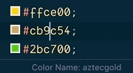

# colornamify-code
Suggests names for colors

Get in on the [Visual Studio Marketplace](https://marketplace.visualstudio.com/items?itemName=reneroth.colornamify-code).

## Features
Will add a status bar entry when selecting a color. Also provides the `colornamify.copy` command, which will copy said name to the clipboard. Visit the [colornamify](https://github.com/reneroth/colornamify) repository for details.

## Using
- [reneroth/colornamify](https://github.com/reneroth/colornamify)
- [satya164/pigment](https://github.com/satya164/pigment)
- [sindresorhus/clipboardy](https://github.com/sindresorhus/clipboardy)

## License
MIT